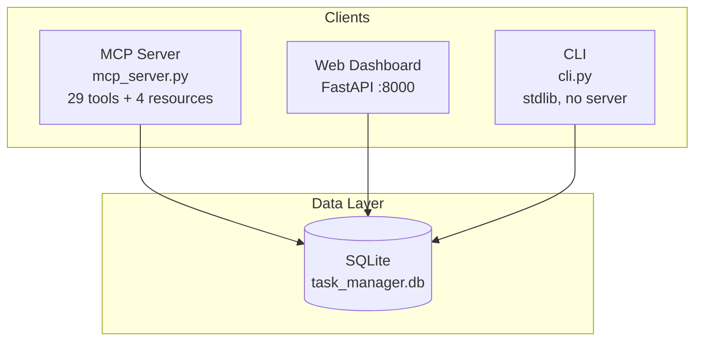

# AI Task Management System

**One database. Three interfaces. Zero sync headaches.**

Agents plan and execute over **MCP**. Humans review progress in a **web dashboard**. Scripts and debug sessions use a **stdlib CLI**. Every surface reads and writes the same SQLite file — so your agent can break work into subtasks while you watch the tree update in the browser, in real time.

Built for teams where AI agents do the work and humans stay in the loop.

---

## Pick your path

| You are… | Start here | Why |
|----------|------------|-----|
| **An AI agent** (Cursor, Claude Desktop, remote worker) | [Quick Start — MCP](#quick-start--mcp-agents) | Workflow tools, strict lifecycle validation, read hints, pinnable playbooks |
| **A human reviewer** | [Quick Start — Dashboard](#quick-start--web-dashboard) | Task trees, docs hub, audit trail, agent management |
| **A scripter / debugger** | [Quick Start — CLI](#quick-start--cli-fallback) | Pure stdlib, JSON everywhere, no server process |
| **Running headless agents at scale** | [Task Orchestrator SDK](#task-orchestrator-sdk) | Walk subtask trees one step at a time via Cursor CLI |

---

## Table of Contents

- [Why this exists](#why-this-exists)
- [Features](#features)
- [Architecture](#architecture)
- [Quick Start — MCP (agents)](#quick-start--mcp-agents)
- [Quick Start — Web Dashboard](#quick-start--web-dashboard)
- [Quick Start — CLI (fallback)](#quick-start--cli-fallback)
- [Docker Deployment](#docker-deployment)
- [Documentation Model](#documentation-model)
- [Strict Lifecycle Rules](#strict-lifecycle-rules)
- [Project Structure](#project-structure)
- [MCP Tools & Resources](#mcp-tools--resources)
- [CLI Reference](#cli-reference)
- [Agent Skill](#agent-skill)
- [Task Orchestrator SDK](#task-orchestrator-sdk)
- [Development](#development)
- [License](#license)

---

## Why this exists

Most task trackers treat agents as afterthoughts — a REST API bolted on, no lifecycle guardrails, no structured docs, no audit trail of *who* changed *what*.

This system flips that:

- **Agents get a first-class MCP server** with workflow tools (`session_context` → `task_begin_work` → `task_record_progress` → `task_complete`), validation that catches sloppy handoffs, and remediation hints when something's wrong.
- **Humans get a dashboard** that renders the same task trees, markdown docs, and audit log — no export/import dance.
- **Everyone shares one SQLite database** (`server/task_manager.db`). Lightweight, portable, inspectable.

The result: structured agent work that humans can actually trust and review.

---

## Features

### Core data model

- **Projects** — Create, update, archive, restore, and track completion progress
- **Ordered task trees** — Root tasks and nested subtasks with fractional-index ordering
- **Six task statuses** — `pending`, `in_progress`, `completed`, `blocked`, `failed`, `cancelled`
- **Three markdown doc slots** — `spec`, `progress`, and `closure` on every project and task
- **Comments** — Timestamped, append-only notes on projects and tasks
- **Audit log** — Field-level mutation history with agent name and master

### MCP agent experience

- **29 MCP tools** — CRUD plus composite workflow tools and enriched read paths
- **Workflow tools** — `session_context`, `task_begin_work`, `task_record_progress`, `task_complete`
- **Strict validation** — Required `initial_spec`, spec-before-work, parent completion blocks, mandatory blocker/failure/closure fields
- **Guided responses** — `warnings`, `next_steps` on reads and mutations; `remediation` on validation errors
- **Static resources** — Pinnable playbook and doc templates (`taskmgr://…` URIs)
- **Multi-agent** — `is_yours` on shared projects via optional `api_key` on read tools
- **Server instructions** — Playbook injected at MCP connect time

### Web dashboard

- **Home** — Create projects, search and filter (active / archived / all), recent activity feed, onboarded agents
- **Project view** — Collapsible task tree, live search, status filter chips
- **Task detail** — Breadcrumb navigation, inline docs, HTMX-powered comments, status updates
- **Documentation hub** — Read-only view of all project and task docs, grouped by task tree
- **Doc editor** — Write markdown with a live preview (marked.js + DOMPurify); views render server-side (Python markdown + bleach)
- **Audit pages** — Per-project and per-agent activity history with pagination
- **Admin** — Agent onboarding, key reissue, password change

### Agent governance

- **Agent onboarding** — Register agents with API keys (audit identity on every mutation)
- **Portable skill** — Drop-in `skill/task-management/` for Cursor and other runtimes (MCP-first)

---

## Architecture



**Doc types** flow through every interface:

```
Project
├── spec      → plan and acceptance criteria (required at MCP create)
├── progress  → work log (never overwrites spec)
└── closure   → summary when done

Task (each)
├── spec / progress / closure
└── subtasks (ordered, nested)
```

**Typical agent session:**

```
session_context → task_begin_work → task_record_progress → task_complete
```

---

## Quick Start — MCP (agents)

### 1. Install dependencies

```bash
cd server
python3 -m pip install -r requirements.txt
python3 cli.py db init   # first run only — creates task_manager.db
```

### 2. Onboard and persist your API key

```bash
# One-time — or use MCP tool agent_onboard from the IDE
python3 cli.py agent onboard --name my-agent --master "Your Name"
```

Save the returned `api_key` **outside the repo**, e.g. `~/.config/task-manager/credentials.json`. Wire it into your MCP client env so context resets do not lose auth:

```json
{
  "mcpServers": {
    "task-manager": {
      "command": "python3",
      "args": ["/absolute/path/to/server/mcp_server.py"],
      "env": {
        "TM_API_KEY": "tm_<your-key>"
      }
    }
  }
}
```

See [skill/task-management/SKILL.md](skill/task-management/SKILL.md) for full key guardrails.

### 3. Start the server

**Stdio** (Cursor, Claude Desktop — subprocess):

```bash
python3 mcp_server.py
```

**HTTP/SSE** (remote agents):

```bash
python3 mcp_server.py --http --port 8000
```

| Endpoint | Purpose |
|----------|---------|
| `GET /sse` | Server-sent events stream |
| `POST /messages?session_id=…` | JSON-RPC messages |
| `POST /mcp` | Streamable HTTP (stateless) |

### 4. Pin MCP resources (recommended)

Attach these read-only resources in your MCP host for stable session context:

| URI | Content |
|-----|---------|
| `taskmgr://reference/playbook` | Agent playbook and lifecycle rules |
| `taskmgr://templates/spec` | `initial_spec` skeleton |
| `taskmgr://templates/progress` | Progress doc skeleton |
| `taskmgr://templates/closure` | Closure doc skeleton |

### 5. Run your first session

```
1. session_context                          → list projects
2. session_context project_id=<id>          → available_tasks, snapshot
3. task_begin_work task_id=<id>             → spec + comments, set in_progress
4. task_record_progress                     → session findings
5. task_complete task_id=<id> closure_note=… → closure + completed
```

Test with the [MCP Inspector](https://github.com/modelcontextprotocol/inspector):

```bash
npx @modelcontextprotocol/inspector http://localhost:8000/sse
```

> **Port conflict:** MCP HTTP and the dashboard both default to port `8000`. Run one on another port, e.g. `python3 mcp_server.py --http --port 8001` or `uvicorn dashboard.app:app --port 8080`.

---

## Quick Start — Web Dashboard

```bash
cd server
python3 -m pip install -r requirements.txt
python3 dashboard/app.py
```

Open **http://localhost:8000** and sign in:

| Field | Default |
|-------|---------|
| Username | `admin` |
| Password | `admin` |

Change the password under **Settings** after first login.

### Key pages

| Page | URL | Description |
|------|-----|-------------|
| Home | `/` | Create projects, search/filter grid, activity feed, agents |
| Project | `/projects/{id}` | Task tree with search and status filters |
| Task detail | `/tasks/{id}` | Breadcrumbs, docs, comments, status updates |
| All docs | `/projects/{id}/docs` | Read-only hub for spec / progress / closure |
| Doc editor | `/projects/{id}/doc` or `/tasks/{id}/doc` | View or edit a single doc |
| Audit log | `/projects/{id}/audit` | Project and task mutation history |
| Agents | `/admin/agents` | Onboarded agents; reissue keys |
| Settings | `/admin/settings` | Change admin password |

---

## Quick Start — CLI (fallback)

Pure Python stdlib — no server process. Useful for **humans**, **debugging**, and **scripts** when MCP is not in use. Agents in Cursor should prefer MCP (validation, hints, workflow tools).

```bash
cd server
python3 cli.py db init

export TM_API_KEY="tm_..."   # required for mutations

python3 cli.py project create "Build Auth System" --desc "JWT-based authentication (40+ chars)"
python3 cli.py task create <PROJECT_ID> "Research options" --desc "..."
python3 cli.py project list --pretty
```

Every command emits **JSON** to stdout. Pass `--pretty` for formatted output.

> **Note:** The CLI does not enforce all MCP validation rules (e.g. required `initial_spec`). New agent-driven work should go through MCP.

---

## Docker Deployment

Ship the MCP server as a container with a persistent database volume.

```bash
docker build -t task-manager .
docker run -d --name task-manager -p 8000:8000 -v tm-data:/data task-manager
```

Agents connect to `http://<host>:8000/sse`.

| Variable | Default | Description |
|----------|---------|-------------|
| `TM_DB_PATH` | `/data/task_manager.db` | SQLite database path |
| `TM_API_KEY` | — | Optional default API key for the server process |

### Docker Compose

```yaml
services:
  task-manager:
    build: .
    ports:
      - "8000:8000"
    volumes:
      - tm-data:/data
    restart: unless-stopped

volumes:
  tm-data:
```

```bash
docker compose up -d
```

---

## Documentation Model

Each project and task has three independent markdown documents:

| Type | When to write | Purpose |
|------|---------------|---------|
| **spec** | At creation (`initial_spec` on MCP create) | `## Objective`, `## Acceptance Criteria` |
| **progress** | Each work session | Running log of findings and status |
| **closure** | At completion | `## Summary` of what was delivered |

**Rules**

- Spec is written once at creation. If requirements change, add a **comment** — do not overwrite spec with progress.
- Use `task_record_progress` (MCP) or `doc_type=progress` for ongoing updates.
- Use `task_complete` or `doc_type=closure` before marking completed.

Worked MCP examples: [skill/task-management/references/examples.md](skill/task-management/references/examples.md)

---

## Strict Lifecycle Rules

Enforced on the MCP API (no opt-out):

| Transition / action | Requirement |
|---------------------|-------------|
| `project_create` / `task_create` | `initial_spec` required (incl. subtasks), min 80 chars, Objective + Acceptance Criteria |
| `in_progress` | Spec doc must exist (`task_begin_work` or `task_update`) |
| `blocked` | `blocker_reason` (min 20 chars) |
| `failed` | `failure_reason` |
| `completed` | Closure doc or `closure_note`; parent blocked while subtasks are active |
| Deletes / archive | `reason` required where applicable |

Validation errors return `remediation` steps. Prefer workflow tools over manual status changes.

---

## Project Structure

```
ai-task-management/
├── Dockerfile
├── README.md
├── AGENTS.md                   # Notes for Cursor Cloud agents
├── server/
│   ├── schema.sql
│   ├── db.py
│   ├── cli.py                  # Stdlib CLI (JSON output)
│   ├── mcp_server.py           # MCP server (stdio + HTTP/SSE)
│   ├── mcp_instructions.py     # Server instructions at connect
│   ├── mcp_resources.py        # Static playbook + templates
│   ├── mcp_validation.py      # Strict lifecycle validation
│   ├── mcp_workflows.py        # session_context, task_begin_work, …
│   ├── mcp_tool_descriptions.py
│   ├── mcp_read_hints.py / mcp_response_hints.py / mcp_enrich.py
│   ├── migrate_project_mcp.py  # Push a local project to remote MCP
│   ├── requirements.txt
│   ├── dashboard/              # FastAPI + Jinja2 + Tailwind
│   └── tests/                  # pytest (db, cli, mcp_*, dashboard)
├── sdk/
│   └── task_orchestrator/      # Sequential subtask orchestrator
└── skill/
    └── task-management/        # Portable MCP-first agent skill
        ├── SKILL.md
        └── references/
```

---

## MCP Tools & Resources

### Workflow tools (start here)

| Tool | Purpose |
|------|---------|
| `session_context` | Session orient — projects, `available_tasks`, optional task focus |
| `task_begin_work` | Start task — spec, comments, `in_progress` |
| `task_record_progress` | Progress doc + optional comment |
| `task_complete` | Closure + completed (blocks if active subtasks) |

### All tools (29)

| Category | Tools |
|----------|-------|
| **Workflow** | `session_context`, `task_begin_work`, `task_record_progress`, `task_complete` |
| **Projects** | `project_create`, `project_list`, `project_get`, `project_snapshot`, `project_update`, `project_archive`, `project_restore`, `project_delete` |
| **Tasks** | `task_create`, `task_list`, `task_get`, `task_tree`, `task_subtree`, `task_update`, `task_move`, `task_delete` |
| **Docs** | `doc_project_get`, `doc_project_update`, `doc_task_get`, `doc_task_update` |
| **Comments** | `comment_add`, `comment_list` |
| **Agents & audit** | `agent_onboard`, `agent_list`, `audit_log_get` |

### Resources (4, read-only)

`taskmgr://reference/playbook` · `taskmgr://templates/spec` · `taskmgr://templates/progress` · `taskmgr://templates/closure`

Full parameters and setup: [skill/task-management/references/reference.md](skill/task-management/references/reference.md)

---

## CLI Reference

| Domain | Commands |
|--------|----------|
| **Database** | `db init` · `db path` |
| **Projects** | `project create` · `list` · `get` · `update` · `delete` |
| **Tasks** | `task create` · `list` · `get` · `tree` · `subtree` · `update` · `move` · `delete` |
| **Docs** | `doc project get/set` · `doc task get/set` |
| **Comments** | `comment add` · `list` · `delete` |
| **Agents** | `agent onboard` · `list` · `audit` · `audit-log` |

```bash
python3 cli.py --help
python3 cli.py task create --help
```

---

## Agent Skill

Portable skill for Cursor and other agent runtimes — **MCP-first**, with API key guardrails for context resets:

```bash
cp -r skill/task-management/ ~/.cursor/skills/task-management/
```

| File | Contents |
|------|----------|
| [SKILL.md](skill/task-management/SKILL.md) | Session workflow, strict rules, key persistence |
| [references/examples.md](skill/task-management/references/examples.md) | MCP worked examples |
| [references/reference.md](skill/task-management/references/reference.md) | Setup, tools, CLI fallback |

---

## Task Orchestrator SDK

Run a headless agent **one subtask at a time** for large task trees. Each invocation passes only a task ID — the agent fetches context from TM via MCP.

```bash
cd sdk && python3 -m pip install -e .

# Preview the work plan
task-orchestrator plan --task <ROOT_TASK_ID> --config examples/orchestrator.yaml --pretty

# Dry run — writes prompts to .tm-runs/ without calling the agent
task-orchestrator run --task <ROOT_TASK_ID> --config examples/orchestrator.yaml --dry-run

# Full run
task-orchestrator run --task <ROOT_TASK_ID> --config examples/orchestrator.yaml --pretty
```

Traversal modes (`depth_first`, `direct_children`, `flatten`), failure policies (`stop`, `pause`, `continue`), and run logs under `.tm-runs/` — see [sdk/README.md](sdk/README.md).

---

## Development

```bash
cd server
python3 -m pip install -r requirements.txt

# Initialize real DB once (CLI subprocess tests use it)
python3 cli.py db init

# Run tests (isolated test DB for most suites)
python3 -m pytest

# MCP tests only
python3 -m pytest tests/test_mcp_*.py -q

# Dashboard with reload (use port 8080 if MCP HTTP is on 8000)
uvicorn dashboard.app:app --reload --port 8080 --app-dir .

# Rebuild dashboard CSS after editing Tailwind sources
cd dashboard && npm install && npm run build:css
```

**SDK tests:**

```bash
cd sdk
python3 -m pip install -e ".[dev]"
python3 -m pytest tests/ -v
```

Tests cover the data layer, CLI, MCP validation/workflows/resources, and dashboard UI. Set `TM_DB_PATH` to point at a different SQLite file when needed.

---

## License

MIT
