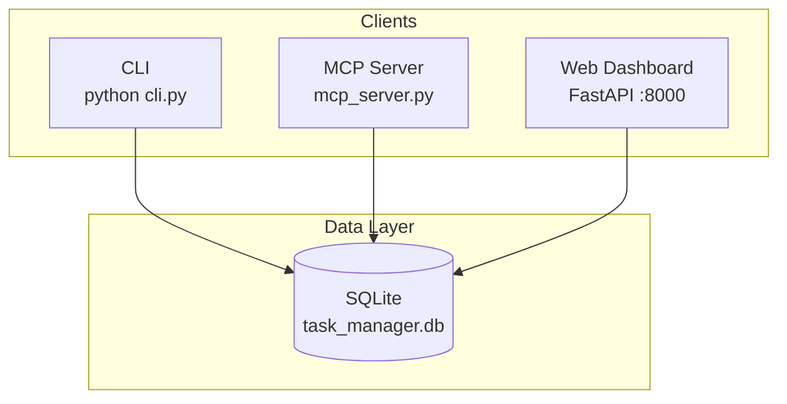

# AI Task Management System

A lightweight task-management platform built for **AI agents and humans**. Track projects, ordered tasks and subtasks, markdown documentation, comments, and a full audit trail — all backed by a single SQLite database.

Use it three ways: **CLI** (zero dependencies), **MCP** (IDE agents), or **Web Dashboard** (visual oversight). Every interface reads and writes the same data, so agents and people can collaborate in real time.

---

## Table of Contents

- [Overview](#overview)
- [Features](#features)
- [Architecture](#architecture)
- [Quick Start — CLI](#quick-start--cli)
- [Quick Start — MCP](#quick-start--mcp)
- [Quick Start — Web Dashboard](#quick-start--web-dashboard)
- [Docker Deployment](#docker-deployment)
- [Documentation Model](#documentation-model)
- [Project Structure](#project-structure)
- [CLI Reference](#cli-reference)
- [MCP Tools](#mcp-tools)
- [Agent Skill](#agent-skill)
- [Development](#development)
- [License](#license)

---

## Overview

| Interface | Best for | Server required |
|-----------|----------|-----------------|
| **CLI** | Scripts, terminals, quick automation | No |
| **MCP** | Cursor, Claude Desktop, remote agents | Yes |
| **Dashboard** | Humans reviewing progress and docs | Yes |

All interfaces share one database (`task_manager.db`). Create a project in the CLI, let an agent update tasks over MCP, and review the result in the browser — no sync step needed.

---

## Features

### Core

- **Projects** — Create, update, archive, and track completion progress
- **Ordered tasks** — Root tasks and nested subtasks with fractional-index ordering
- **Six task statuses** — `pending`, `in_progress`, `completed`, `blocked`, `failed`, `cancelled`
- **Markdown docs** — Three doc types per project and task: `spec`, `progress`, `closure`
- **Comments** — Timestamped, append-only notes on projects and tasks

### Agent & governance

- **Agent onboarding** — Register agents with scoped API keys
- **Audit log** — Every mutation recorded with agent identity and field-level diffs
- **Portable skill** — Drop-in skill folder for Cursor and other agent runtimes

### Web Dashboard

- **Home** — Project grid, search and filters, recent activity feed, onboarded agents
- **Project view** — Task tree with collapsible subtasks, search, and status filters
- **Documentation hub** — Read-only view of all project and task docs, grouped by task tree
- **Markdown rendering** — Client-side preview via marked.js with sanitized HTML
- **Audit pages** — Per-project and per-agent activity history
- **Archive** — Soft-delete projects (restore anytime)

### Interfaces

- **CLI** — Pure Python, argparse, JSON output (add `--pretty` for humans)
- **MCP** — 22 tools over stdio or HTTP/SSE
- **Dashboard** — FastAPI + Jinja2 + Tailwind

---

## Architecture



**Doc types** flow through every interface:

```
Project
├── spec      → plan and acceptance criteria
├── progress  → work log (never overwrites spec)
└── closure   → summary when done

Task (each)
├── spec / progress / closure
└── subtasks (ordered, nested)
```

---

## Quick Start — CLI

Requires **Python 3.10+**. No pip install needed.

```bash
cd server

# Initialize the database (first run only)
python cli.py db init

# Onboard an agent (required before mutations)
python cli.py agent onboard --name my-agent --master "Your Name"

# Create a project and tasks
python cli.py project create "Build Auth System" --desc "JWT-based authentication"
python cli.py task create <PROJECT_ID> "Research options"
python cli.py task create <PROJECT_ID> "Implement JWT" --after <TASK_ID>

# Attach a spec doc to a task
python cli.py doc task set <TASK_ID> "# Spec\n## Objective\n..." --type spec

# Check progress
python cli.py project get <PROJECT_ID> --pretty
```

Every command emits **JSON** to stdout. Pass `--pretty` for formatted output.

---

## Quick Start — MCP

### 1. Install dependencies

```bash
cd server
pip install -r requirements.txt
```

### 2. Start the server

**Stdio** (local subprocess — Cursor, Claude Desktop):

```bash
python mcp_server.py
```

**HTTP/SSE** (remote agents, web clients):

```bash
python mcp_server.py --http --port 8000
```

| Endpoint | Purpose |
|----------|---------|
| `GET /sse` | Server-sent events stream |
| `POST /messages?session_id=…` | JSON-RPC messages |

### 3. Configure your client

**Cursor** — `.cursor/mcp.json`:

```json
{
  "mcpServers": {
    "task-manager": {
      "command": "python",
      "args": ["/absolute/path/to/server/mcp_server.py"]
    }
  }
}
```

**SSE client**:

```json
{
  "mcpServers": {
    "task-manager": {
      "type": "sse",
      "url": "http://localhost:8000/sse"
    }
  }
}
```

Test with the [MCP Inspector](https://github.com/modelcontextprotocol/inspector):

```bash
npx @modelcontextprotocol/inspector http://localhost:8000/sse
```

> **Tip:** The MCP server and dashboard both default to port `8000`. Run one on a different port if you need both simultaneously, e.g. `uvicorn app:app --port 8080`.

---

## Quick Start — Web Dashboard

```bash
cd server
pip install -r requirements.txt
python dashboard/app.py
```

Open **http://localhost:8000** and sign in:

| Field | Default |
|-------|---------|
| Username | `admin` |
| Password | `admin` |

Change the password under **Settings** after first login.

### Key pages

| Page | URL | Description |
|------|-----|-------------|
| Home | `/` | Projects, activity feed, agents |
| Project | `/projects/{id}` | Tasks, progress, comments |
| All docs | `/projects/{id}/docs` | Read-only hub for spec / progress / closure |
| Doc editor | `/projects/{id}/doc` | View or edit a single doc |
| Audit log | `/projects/{id}/audit` | Project and task mutation history |
| Agents | `/admin/agents` | Onboarded agents and activity |

---

## Docker Deployment

Ship the MCP server as a container with a persistent database volume.

```bash
# Build
docker build -t task-manager .

# Run
docker run -d \
  --name task-manager \
  -p 8000:8000 \
  -v tm-data:/data \
  task-manager
```

Agents connect to `http://<host>:8000/sse`.

### Environment variables

| Variable | Default | Description |
|----------|---------|-------------|
| `TM_DB_PATH` | `/data/task_manager.db` | SQLite database path |

### Docker Compose

```yaml
services:
  task-manager:
    build: .
    ports:
      - "8000:8000"
    volumes:
      - tm-data:/data
    restart: unless-stopped

volumes:
  tm-data:
```

```bash
docker compose up -d
```

---

## Documentation Model

Each project and task supports three independent markdown documents:

| Type | When to write | Purpose |
|------|---------------|---------|
| **spec** | At creation | Scope, objectives, acceptance criteria |
| **progress** | During work | Running log of decisions and changes |
| **closure** | At completion | Summary and outcomes |

**Rules of thumb**

- Never overwrite a spec to record progress — use the progress doc instead.
- View all docs for a project at `/projects/{id}/docs` (tabbed by type, grouped under the task tree).
- Agents write docs via CLI (`doc project set` / `doc task set`) or MCP (`doc_project_update` / `doc_task_update`).

Full workflow examples: [skill/task-management/references/examples.md](skill/task-management/references/examples.md)

---

## Project Structure

```
my-agent-project/
├── Dockerfile
├── README.md
├── server/
│   ├── schema.sql              # SQLite schema
│   ├── db.py                   # Data access layer
│   ├── cli.py                  # CLI (zero extra dependencies)
│   ├── mcp_server.py           # MCP server (stdio + HTTP/SSE)
│   ├── requirements.txt
│   ├── dashboard/
│   │   ├── app.py              # FastAPI dashboard
│   │   └── templates/          # Jinja2 HTML templates
│   └── tests/
│       ├── conftest.py
│       ├── test_cli.py
│       └── test_db.py
└── skill/
    └── task-management/
        ├── SKILL.md
        └── references/
            ├── reference.md    # Full API + CLI reference
            └── examples.md     # Worked examples
```

---

## CLI Reference

| Domain | Commands |
|--------|----------|
| **Database** | `db init` · `db path` |
| **Projects** | `project create` · `list` · `get` · `update` · `delete` |
| **Tasks** | `task create` · `list` · `get` · `tree` · `subtree` · `update` · `move` · `delete` |
| **Docs** | `doc project get/set` · `doc task get/set` |
| **Comments** | `comment add` · `list` · `delete` |
| **Agents** | `agent onboard` · `list` · `audit` · `audit-log` |

```bash
python cli.py --help                  # Top-level help
python cli.py task create --help      # Per-command help
```

---

## MCP Tools

22 tools mirroring the CLI surface:

| Category | Tools |
|----------|-------|
| **Projects** | `project_create`, `project_list`, `project_get`, `project_update`, `project_delete` |
| **Tasks** | `task_create`, `task_list`, `task_get`, `task_tree`, `task_subtree`, `task_update`, `task_move`, `task_delete` |
| **Docs** | `doc_project_get`, `doc_project_update`, `doc_task_get`, `doc_task_update` |
| **Comments** | `comment_add`, `comment_list` |
| **Agents & audit** | `agent_onboard`, `agent_list`, `audit_log_get` |

Full schemas and parameters: [skill/task-management/references/reference.md](skill/task-management/references/reference.md)

---

## Agent Skill

The `skill/task-management/` folder is portable. Copy it into your agent's skill directory:

```bash
cp -r skill/task-management/ ~/.cursor/skills/task-management/
```

The skill covers onboarding, CLI workflows, MCP usage, doc conventions, and audit practices.

---

## Development

```bash
cd server
pip install -r requirements.txt

# Run tests (uses isolated test database)
python -m pytest

# Run dashboard with auto-reload
uvicorn dashboard.app:app --reload --port 8080 --app-dir .
```

Tests cover the data layer, CLI output, fractional task ordering, documentation CRUD, and audit activity queries.

---

## License

MIT
